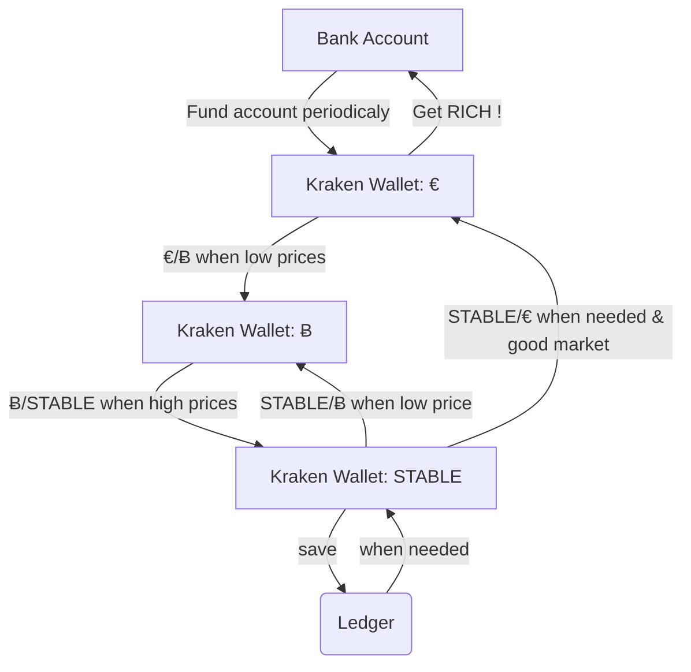
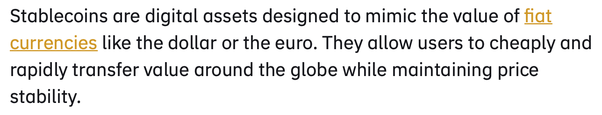
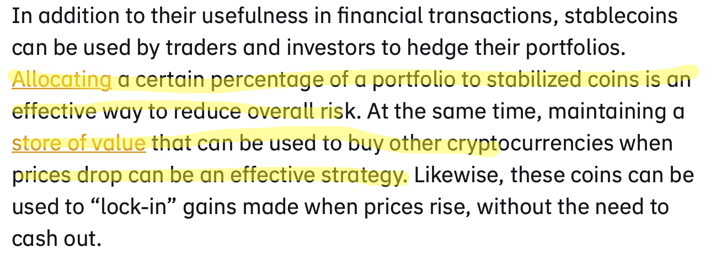

# Cryptocurrency

#crypto

## Getting to Bitcoin Trading
I invested in It (small amount) in march 2020 when bitcoin price was low (covid19 crash). This was a successfull investment and will try to renew the experience with bigger investments.

There are a lot of crypto currencies but I want to first invest € to buy Ƀ (bitcoins). Starting slow...

### Defining Value flow

process summary:

- fund kraken account with €
- buy bitcoins
- trade bitcoins with stable coin
- redistribute stable coins between:
    - a safe (Ledger)
    - reinvest

#### Why use Kraken ?
- No fees to send € to this platform,
- supports SEPA instant,
- relatively low trading fees (if occasional)
- Have reputation of secure platform

#### Why use stable coin ?

>  
> [source](https://academy.binance.com/en/articles/what-are-stablecoins)

Stable coin follow FIAT currencies (real money like $ or €).

>  
> [source](https://academy.binance.com/en/articles/what-are-stablecoins) 

As stablecoin follow much "safer" coins, it is a good way to save gained value without getting money out of the platform every time (fees are applied when doing so). Moreover, it is easier to rebuy crypto with theses stable coins rather than trading FIAT to bitcoin everytime.

Storing gained value in stablecoins has another considerable advantage: the possibility to take the value to a safe place: out of the platform, on a [cold wallet](https://shop.ledger.com/products/ledger-nano-s). This is obviously not possible with FIAT.

### Looking for indicator
Interesting indicator to check:
 - CRSI20 (cyclic RSI)

