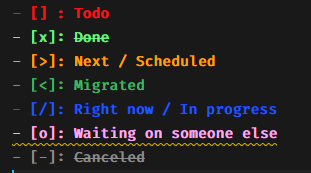

# 2020-11-18

- [/] Define [[digital-bujo-templates]]

## Bullet journal boxes styling for vscode

#journaling #bujo #vscode

The `publicus.org-checkbox` extension is nice to render boxes inspired by bullet journaling. But the general theme is not what I like. I settup custom settings using the `fabiospampinato.vscode-highlight` extension resulting in this:



Sadly, those color are not rendered on github but as journal is supposed to be used throughout the day in VS code, thus, this is not an issue.

Highlight settings:

```json
  "highlight.regexes": {
    "(\\- ?\\[ ?\\].*)": [
        {
        "color": "#ff0f16",
        "fontWeight": "bold"
        }
    ],
    "(\\- ?\\[x\\] ?:? ?)(.*)": [
        {
        "color": "#6bf285",
        "fontWeight": "bold",
        },
        {
        "color": "#6bf285",
        "fontWeight": "bold",
        "textDecoration": "line-through"
        }
    ],
        "(\\- ?\\[\\/\\].*)": [
        {
            "color": "#1d58ff",
            "fontWeight": "bold"
        }
        ],
    "(\\- ?\\[\\>\\].*)": [
        {
        "color": "#ffa200",
        "fontWeight": "bold"
        }
    ],
    "(\\- ?\\[\\<\\].*)": [
        {
        "color": "#3eb563",
        "fontWeight": "bold"
        }
    ],
    "(\\- ?\\[\\-\\] ?:? ?)(.*)": [
        {
        "color": "#8b8b8b",
        "fontWeight": "bold"
        },
        {
        "color": "#8b8b8b",
        "fontWeight": "bold",
        "textDecoration": "line-through",
        }
    ],
    "(\\- ?\\[\\o\\].*)": [
        {
        "color": "#faabf0",
        "fontWeight": "bold"
        }
    ]
}
```

[//begin]: # "Autogenerated link references for markdown compatibility"
[digital-bujo-templates]: digital-bujo-templates "Digital Bujo TEmplates"
[//end]: # "Autogenerated link references"