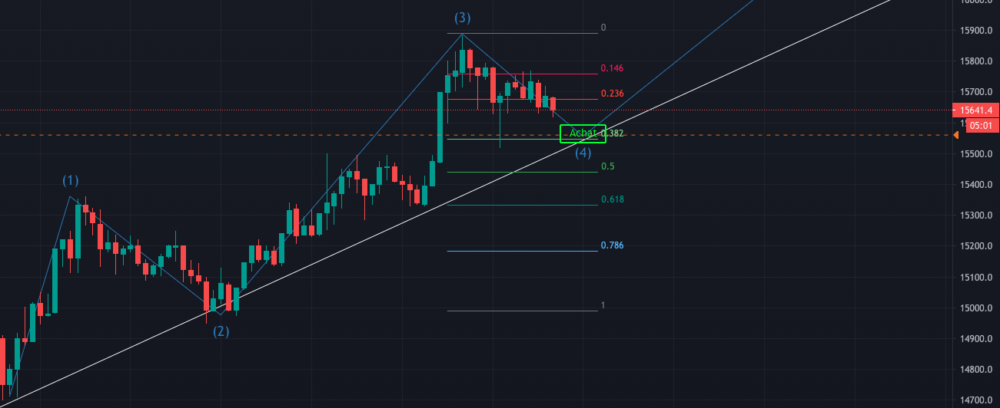

# 2020-11-20

- [x] Ajouter fonction dans pyBDST pour telecharger des tables en local
- [x] Relancer les workflows oozie
- [x] Packager Vizoozie 
- [X] Trouver un cadeau pour papa avec Garance & Sophie
  - [>] Trouver une marque de jean made in France, robuste, élégant
-  Découverte d'une ressource bien construite sur les eliott waves: https://elliottwave-forecast.com/elliott-wave-theory. Ajouté à [[cryptocurrency]].
-  Placement d'une option d'achat BTC à 1560 € (pour 100 €):
      

[//begin]: # "Autogenerated link references for markdown compatibility"
[cryptocurrency]: ../cryptocurrency "Cryptocurrency"
[//end]: # "Autogenerated link references"