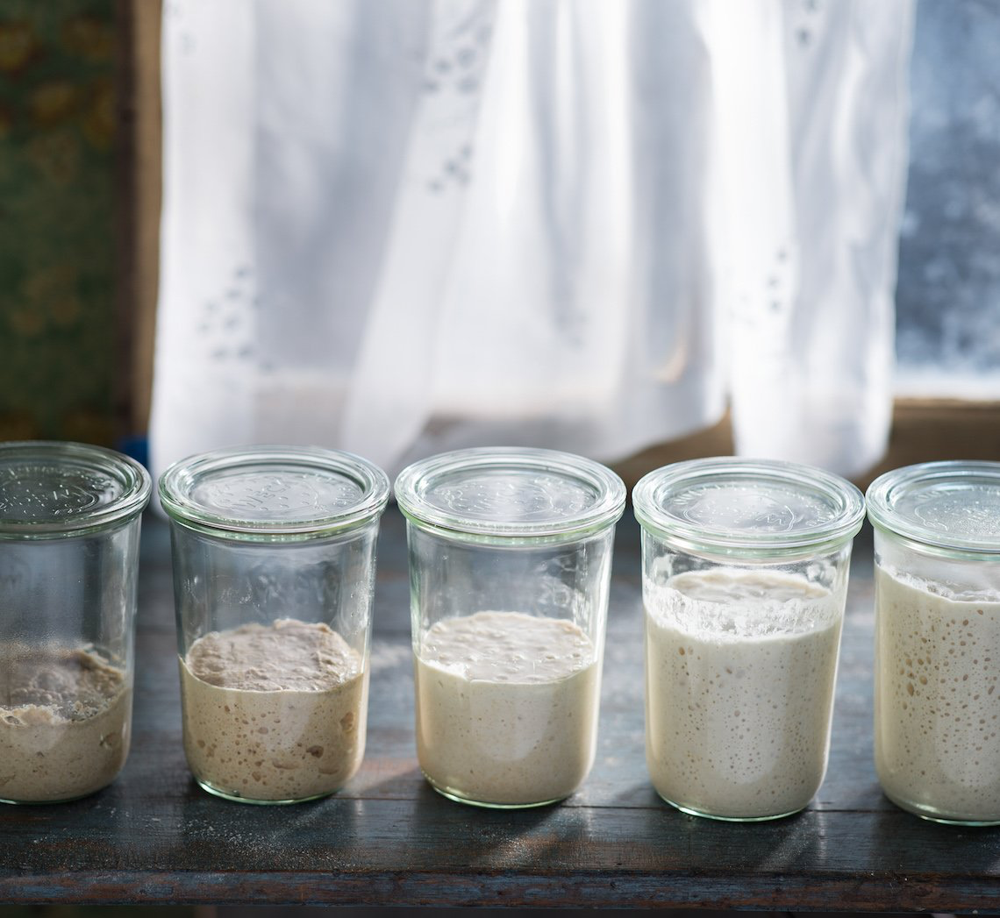
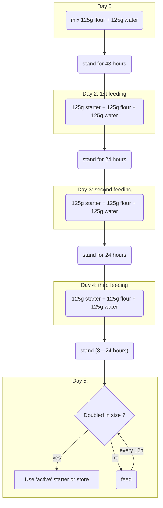

# Levain

# Sourdough Culture (Levain)

  

## Experiments

### Method 1: Bake Club Sourdough Starter

Source: https://bakeclub.com.au/collections/recipes/products/sourdough-starter

#### Process Summary

#### Try: 0

##### Day 0 / 2020-04-10 14H00

In a **660g** clean and dry pickle jar:

- **100g** organic **rye** flour
- **125g** tap water (transferred 3 times between two glasses)

Mixed for 1 ∑minutes, closed with the jar and put on top of the fridge.

Next step will be the **first feeding** after 48 hours.

##### Day 2 / 2020-04-12 20H00

Mild pickle smell when opened the lid. I guess it wasn’t clean enough ...

* Removed all but 125g of starter.
* Added 126g of organic white flour
* Added 125g tap water
* Mixed for 1 minute
* Stored on top of the fridge (room ~19°c)

Next step will be the **second feeding** after 24H. Hope the yea

##### Day 3 / 2020-04-13 20H15

Pickle smell is more subtle today. Good thing.

* Removed all but 125g of starter.
* Added 125g of organic white flour
* Added 125g tap water
* Mixed for 30 seconds
* Stored on top of the fridge (room ~20°c).

The jar I used has narrower opening than the side. Almost impossible to clean correctly, thus:

1. The weighting is false (lot of fresh material is stuck on the sides but not part of the mixture)
2. Old and bad starter dried out on the side, potential contamination ?
3. Impossible to see the level of starter through unclean glass.

**➡️ Really need a jar like the ones on the picture at the top of this note**

Coked the starter I removed like a pancake. It turned into an alveolate structure and smell like bread crumb. It looks like it takes a lot of time to be baked correctly. I'll try to put them in the oven.

Next step is the **third (and last) feeding**.

##### Day 4 / 2020-04-14 20H13

* Removed all but 125g of starter.
* Added 125g of organic white flour
* Added 125g tap water
* Mixed for 30 seconds

Stored on top of the fridge ~20°c

##### Day 5 / 2020-04-15 16H
Starter doub

* Removed all but 125g of starter.
* transfered to a new jar, easier to clean.
* Added 125g of organic white flour
* Added 125g tap water
* Mixed for 30 seconds
* stored for 2 hours on top of the fridge
* put in the fridge.

Next feeding 

### Method 2: Bread Scheduler

http://www.breadscheduler.com/#/recipe/5e89e208aa3c8d002393a317

#### Try: 1

#### Day 0 2020-12-12

Mix 113 grams of T80 flour with 113 grams of water in a glass jar (empty and without lid: 252g)

### Method 3: Marmiton

Source: https://www.marmiton.org/cuisine-fait-maison/faire-du-levain-s3010544.html

Not tested but quite different than the method 1...

# Keep Sourdough alive

## Storing Sourdough

Sourdough can be stored at room temperature, in the fridge or even in the freezer. Feeding frequency depends on the way it is stored.

## Feeding Sourdough

Once the sourdough is established, healthy and strong (doubling in size in 8hours at room temperature). It needs to be fed regularly to be kept active. If not, the yeast will run out of food and die.

If stored in the **fridge**, the starter need to be fed **1 time** a week. Stored at **room temperature**, it needs to be fed **everyday**.

To feed it use a clean utensil to:

- Remove all but 125g of sourdough starter.
- Add 125g plain flour
- Add 125 g water
- Stir until evenly combined.

Store the jar (wait 2-3 hours before doing so if stored in the fridge).

> A sourdough starter stored at room temperature and fed everyday will have a **milder flavour** than one kept in the fridge and fed once a week.

## More Sourdough !

> If you want to increase the amount of sourdough starter you have, especially if you want to share it, you just need to ‘feed’ it with 125 g flour and 125 g water without first discarding any of the sourdough starter until you reach the desired quantity.

## Freezing Sourdough

> Sourdough starter can be frozen, if you would like to store it for a long period without feeding. To do this, double the amount of flour added at feeding so that it is a very thick paste, place in an airtight container and freeze for up to 1 year. Thaw at room temperature and feed as above to regain its strength before using.

## Liquid on top ?

> If a grey-like liquid forms on top of your sourdough starter, this is an indication that an excess of alcohol has been produced as a by-product of the yeast fermentation. It often appears if the sourdough starter is ‘hungry’ because it has been left for longer periods of time without feeding or if it requires more frequent feeding.
>
> If there is only a thin layer, you can either stir this liquid back into the sourdough starter or drain it away before feeding it again. If you stir it through, it will add a more intense flavour to your sourdough starter and, in turn, your sourdough bread.
>
> If there is a thick layer, it is best to discard it before feeding.

# Using Sourdough

When sourdough starter is needed in a recipe, [feed](#feeding-sourdough) it and let it at room temperature for 4-8 hours before using it. It should at least double in volume and bubble should be breaking the surface: the starter is active. If it did not doubled, repeat the feeding and standing process until it does.

Remove the amount required and feed it again before storing it back.

